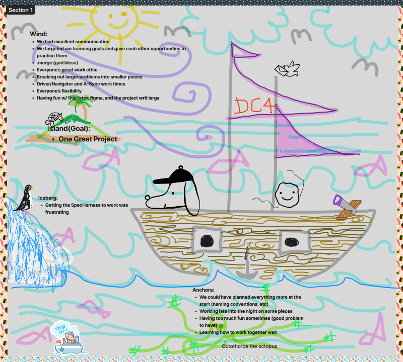

```
______     _   _           _      __
|  ___|   | | | |         | |  .'".'"'.
| |_ _   _| |_| |__   ___ | | :._.""._.:
|  _| | | | __| '_ \ / _ \| | :  \__/  :
| | | |_| | |_| |_) | (_) | |  './  \.'
\_|  \__,_|\__|_.__/ \___/|_|     ""
```
### Brought to you by DefCom4

## Table of Conents 
- [Check-in](#check-in)
- [Organization](#organization)
- [Design-Approach](#design-approach)
- [DTR](#dtr)
- [Contributors](#contributors)
- [Retrospective](#retrospective)


## Check-in
- Daily morning stand ups in slack
- Group work time in study hall/collaborate when needed
- Created protocol for reaching out to team if unproductive struggle for >= 1hr

[Return to Top](#table-of-conents)

## Organization
- [DefCom4 Figma Board](https://www.figma.com/file/KlqoaiCb4qATpYk1rt6UUV/Futbol?node-id=0%3A1&t=YJCr2TCN91YUfkQH-0)
- [DefCom4 GitHub Project](https://github.com/users/andrew-bingham1/projects/1/views/2)
- Adhere to a formula for writing commit messages to streamline readability

[Return to Top](#table-of-conents)

## Design Approach
- Adherence to SRP
- Russian nesting doll approach
- Refactor after functionality is achieved
[Return to Top](#table-of-conents)

## DTR
- [Original DTR](https://docs.google.com/document/d/1mXX4xO6k7aFdUO3jWYz3Tc7ONjrx3_nEftG3Vrv3wkc/edit#)
- [Second DTR](https://docs.google.com/document/d/1dsquJocsr7bqSM_DtHpanRetoTp94kxvl0w0n0TGJl0/edit?usp=sharing)

[Return to Top](#table-of-conents)

## Contributors
- Angel Byun - [LinkedIn](https://www.linkedin.com/in/angel-byun-a0274a267/) - [Github](https://github.com/angelbyun)

- Andrew Bingham - [LinkedIn](https://www.linkedin.com/in/andrew-b-59321017b/) - [Github](https://github.com/andrew-bingham1)

- Thomas Hawley - [LinkedIn](https://www.linkedin.com/in/thomas-hawley-901612123/) - [Github](https://github.com/thawley2)

- Crow Rising - [LinkedIn](https://www.linkedin.com/in/crowrising/) - [Github](https://github.com/CrowRising)

[Return to Top](#table-of-conents)

## Retrospective 


[Sailboat Method](https://thedigitalprojectmanager.com/projects/leadership-team-management/how-run-sprint-retrospective/#sailboat-method) 
- This is where we discovered this method for running a retrospective

### Top things that went well during your project 
- We had excellent communication 
- We targeted our learning goals and gave each other opportunities to practice them 
- Everyone’s great work ethic
### Top things your team would do differently next time
- We should have planned everything more at the start (naming conventions, etc)
- Should have avoided working late into the night on some pieces 

[Return to Top](#table-of-conents)